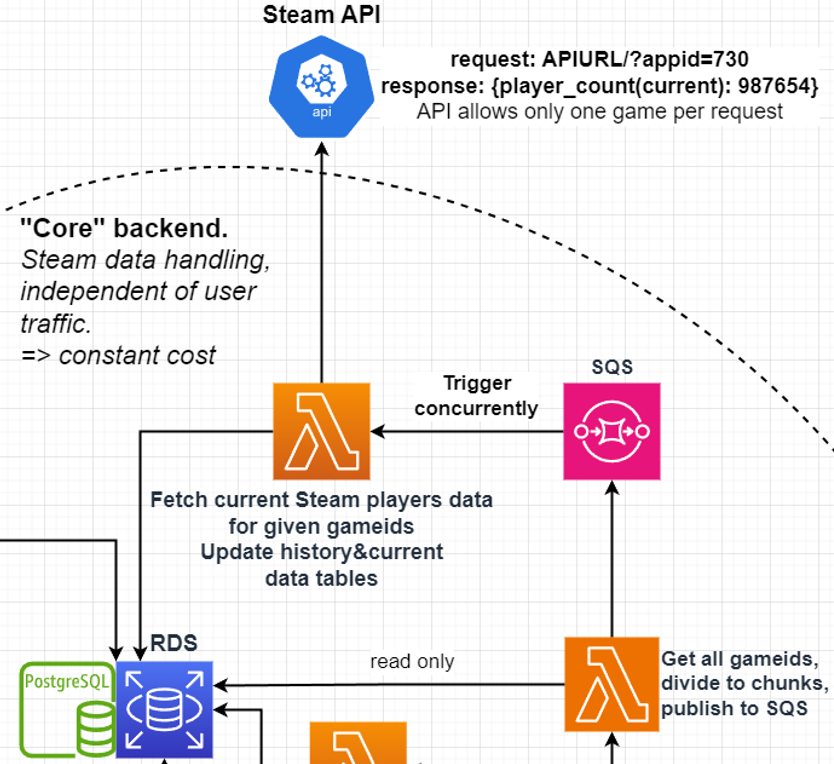

### Lambda Responsibility
SQS triggers the Lambda and gives it an array of gameids. Lambda fetches current player count from Steam API for those games and updates it to the RDS. Then from RDS, reads past 24 hour player counts, and calculates 24 hour peak and bottom with them, saving them to the RDS.

**Notice!** By inserting multiple different gameid arrays to the SQS (as individual items), this Lambda can be triggered concurrently to add scaling for the process.

#### Possible improvements
Calculating 24 hour peak and bottom can be optimized by using a sliding window and in every update cycle, comparing the new player count to the current peak and bottom. And also tracking if the current peak or bottom "drops" out of the window, i.e. becomes more than 24 hours old.

##### **Succesful execution returns:**
```json
{
  "statusCode": 200,
  "body": {
    "rejectedSteamRequestsCounter",
    "invalidPlayerCountOrIdCounter",
  }
}
```
**Notice**! Execution is considered as succesful even if the counters are not zeros.

##### **Unsuccesful execution returns:**
```json
{
  "statusCode": 500,
  "body": {
    "rejectedSteamRequestsCounter",
    "invalidPlayerCountOrIdCounter",
  }
}
```
**rejectedSteamRequestsCounter** is an integer from 0 to n representing how many of the requests sent to Steam API failed, e.g. to request limits.

**invalidPlayerCountOrIdCounter** is an integer from 0 to n representing how many player counts or gameids were invalid. i.e. They are not numbers.


### Version History
| Version | Changes |
| ------------- | ------------- |
| v4 | <ins>Changed:</ins> Instead of reading RDS, Lambda gets an array of gameIds from SQS that triggers the Lambda.<br> + Env variables and refactor. |
| v3 | <ins>Changed:</ins> When calculating player count peak and bottom, exclude zero values because Steam API sometimes returns zeroes incorrectly. |
| v2  | <ins>Added:</ins> Lambda returns two numbers indicating errors encountered during fetching Steam API.<br> + Optimizations |
| v1  | Reads priority 1 gameIds from RDS, fetches current players from Steam, saves current players and calculates 24h peak and bottom player count using earlier player counts from RDS |
