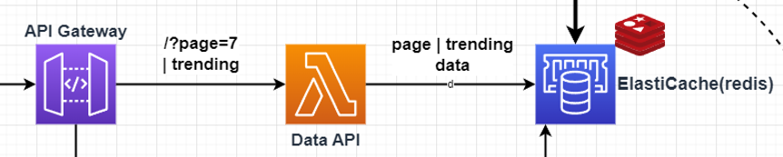

### Lambda Responsibility
API for the client data requests. Provides data for current players and trending games tables. Search queries are handled by another Lambda (SearchAPI).

##### **Succesful execution returns:**
```json
{
  statusCode: 200,
  body: { data, aff: affData },
  headers: { 'Access-Control-Allow-Origin': origin }
}
```

##### **Unsuccesful execution returns:**
```json
{
    statusCode: 500,
    body: { message: errorMsg },
    headers: { 'Access-Control-Allow-Origin': '*' },
}
```

### Version History
| Version | Changes |
| ------------- | ------------- |
| v7  | <ins>Added:</ins> More allowed origins. |
| v6  | <ins>Added:</ins> Read and return affiliate data together with trending data. |
| v5 | <ins>Added:</ins> Read and return daily trending games from ElastiCache, if requested. And better error responses. |
| v4 | <ins>Added:</ins> Cors and allowed origins list. |
| v3 | <ins>Changed:</ins> Use reader endpoint. |
| v2  | <ins>Changed:</ins> Read data from ElastiCache instead of RDS. |
| v1  | Reads page data from RDS requested by client. |
