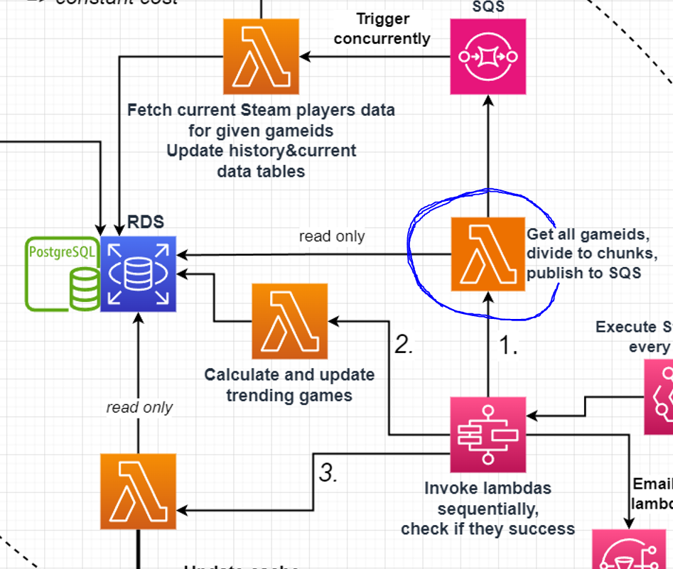

### Lambda Responsibility
Read game ids from RDS, divide them into chunks and publish chunks as separate items to SQS.

#### CONSTANTS
| Name | Value | Description |
| ------------- | ------------- |  ------------- |
| chunkSize | 300 | How many game ids are in one SQS item. |
| maxPriority | 3 | All game ids with priority {maxPriority} or lower are read from RDS. |

##### **Succesful execution returns:**
```json
{
  "statusCode": 200,
}
```

##### **Unsuccesful execution returns:**
Execution will be marked failed. Nothing returned.

##### Possible reasons for unsuccesful execution:
- Connection problem with RDS
- No game ids found from RDS
- Problem sending item to SQS


### Version History
| Version | Changes |
| ------------- | ------------- |
| v1  | Get game ids with specific priority from RDS, divide to chunks and publish to SQS. |
