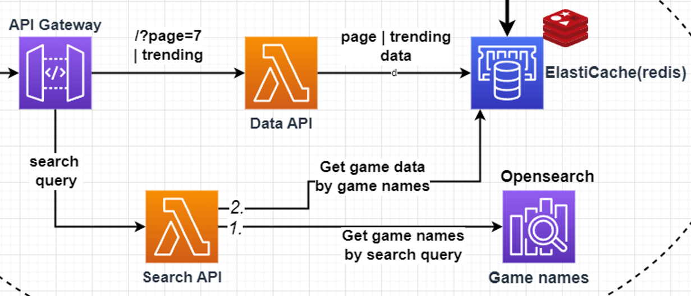

### Lambda Responsibility
Acts as an API for the search queries from the client. After sanitizing query, finds matching game names from OpenSearch and then gets the data for those from ElastiCache (redis).

#### CONSTANTS
| Name | Value | Description |
| ------------- | ------------- |  ------------- |
| maxItemsReturnedFromOpenSearch | 50 | Tells OpenSearch to return a maximum of 50 game name matches for a search query. |
| axiosTimeout | 10000 | Timeout (ms) when getting game names from OpenSearch. |
| maxQueryLength | 30 | Only the first 30 characters of a search query are used. Rest is ignored. |

##### **Succesful execution returns:**
```json
{
  "statusCode": 200,
  "body": [{
    "gameid": 289070,
    "playercount": 43237,
    "peak": 50674,
    "bottom":28236, 
    "gamename": "Sid Meier's Civilization VI",
    }],
  "headers": { 
    "Access-Control-Allow-Origin": "*",
  },
}
```

##### **Unsuccesful execution returns:**
```json
{
  "statusCode": 500,
  "headers": { 
    "Access-Control-Allow-Origin": "*",
  },
}
```
##### Possible reasons for unsuccesful execution:
- Connection problem with ElastiCache
- Connection problem with OpenSearch


### Version History
| Version | Changes |
| ------------- | ------------- |
| v1  | Sanitize user search query, get hits (game names) from OpenSearch and get game data from ElastiCache. |
