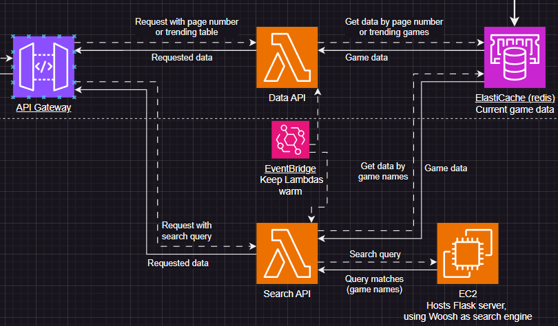

### Lambda Responsibility

Acts as an API for the search queries from the client. After sanitizing query, finds matching game names from EC2(Flask&Woosh) and gets the data for those from ElastiCache(redis).

#### CONSTANTS

| Name           | Value | Description                                                               |
| -------------- | ----- | ------------------------------------------------------------------------- |
| axiosTimeout   | 5000  | Timeout (ms) when getting game names from EC2.                            |
| maxQueryLength | 30    | Only the first 30 characters of a search query are used. Rest is ignored. |
| gamesReturned  | 10    | Number of results returned.                                               |

##### **Succesful execution returns:**

```json
{
  "statusCode": 200,
  "body": [
    {
      "gameid": 289070,
      "playercount": 43237,
      "peak": 50674,
      "bottom": 28236,
      "gamename": "Sid Meier's Civilization VI"
    }
  ],
  "headers": {
    "Access-Control-Allow-Origin": "*"
  }
}
```

##### **Unsuccesful execution returns:**

```json
{
  "statusCode": 500,
  "body": [],
  "headers": {
    "Access-Control-Allow-Origin": "*"
  }
}
```

##### Possible reasons for unsuccesful execution:

- Connection problem with ElastiCache
- Connection problem with EC2
- Search server in EC2 broken or down

### Version History

| Version | Changes                                                                                               |
| ------- | ----------------------------------------------------------------------------------------------------- |
| v2      | <br><ins>Changed:</ins> Use EC2 instead of OpenSearch to match query. </br> + Refactoring             |
| v1      | Sanitize user search query, get hits (game names) from OpenSearch and get game data from ElastiCache. |
