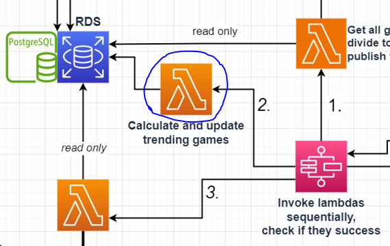

### Lambda Responsibility
Calculates the player count increase/decrease of games by comparing the average player count of the last 12 hours vs last 24-36 hours. i.e. from 13.30 to 01.30 today vs the same timeframe yesterday. This can be thought as two sliding windows.\
If player count has decreased, the number is negative.

#### CONSTANTS
| Name | Value | Description |
| ------------- | ------------- |  ------------- |
| maxPriority | 3 | Calculate daily increase for every game with priority {maxPriority} or lower. |


##### **Succesful execution returns:**
```json
{
  "statusCode": 200,
}
```

##### **Unsuccesful execution returns:**
```json
{
  "statusCode": 500,
}
```

##### Possible reasons for unsuccesful execution:
- Connection problem with RDS


### Version History
| Version | Changes |
| ------------- | ------------- |
| v2 | <ins>Fixed:</ins> Set increase to zero if it is not finite. (happens with insufficient data)<br> </ins><ins>Changed:</ins> Process every game with priority 3 or lower.<br> + Env variables and refactor |
| v1  | For every priority 1 game in RDS, calculate daily player increase |
